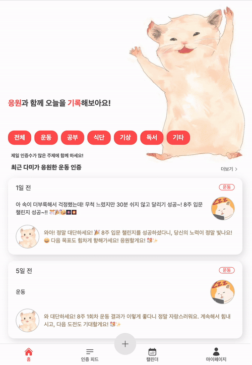
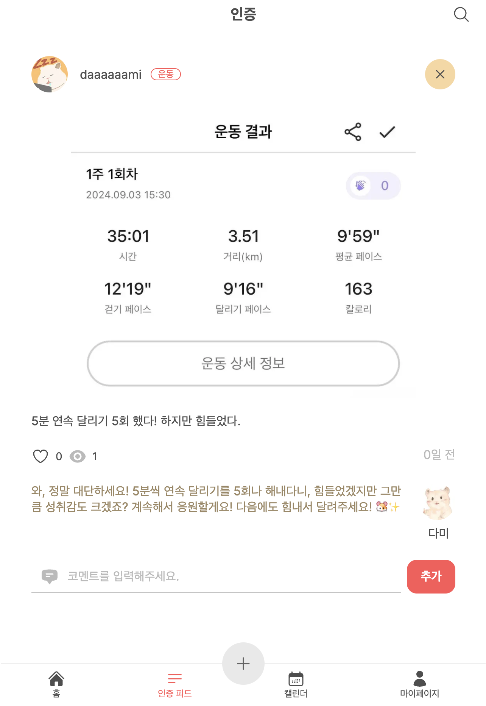
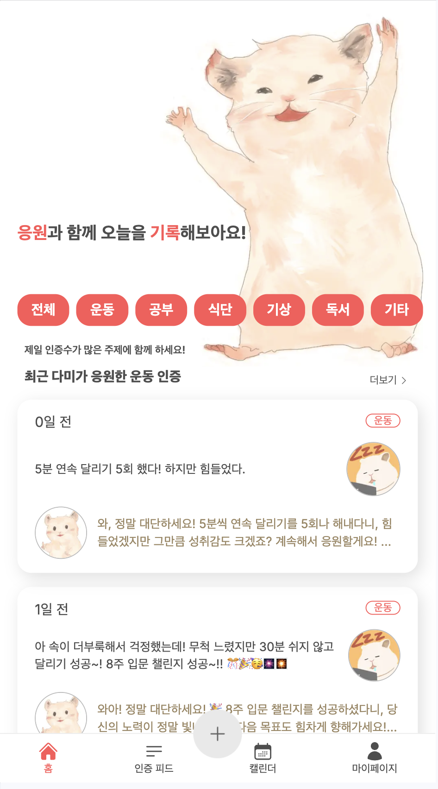
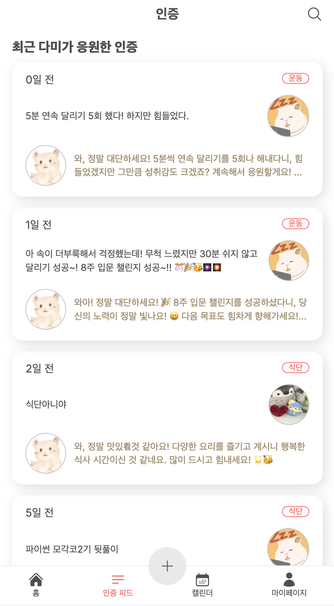
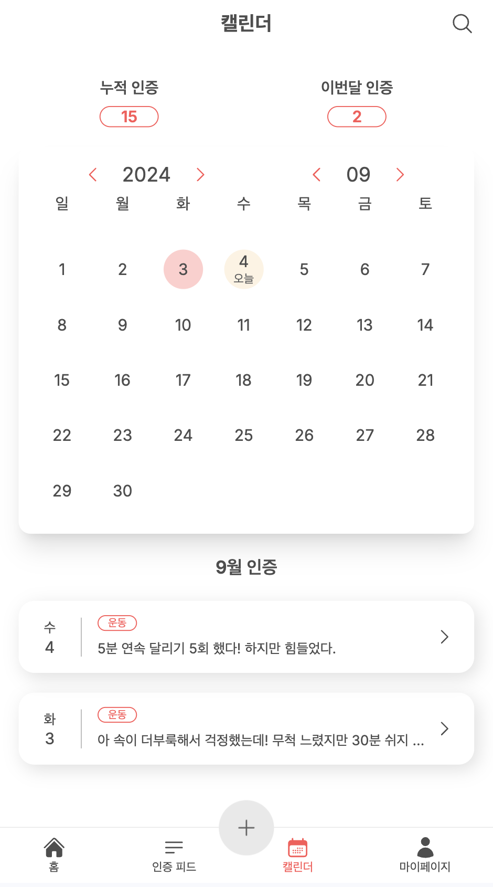
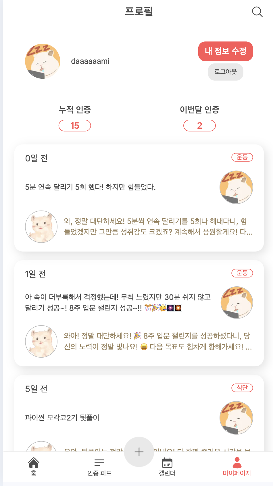
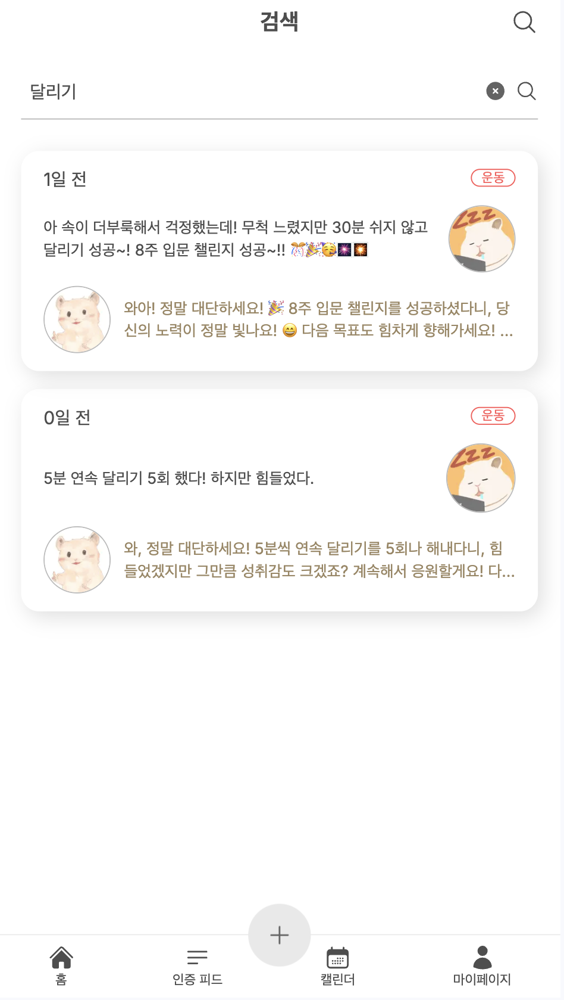
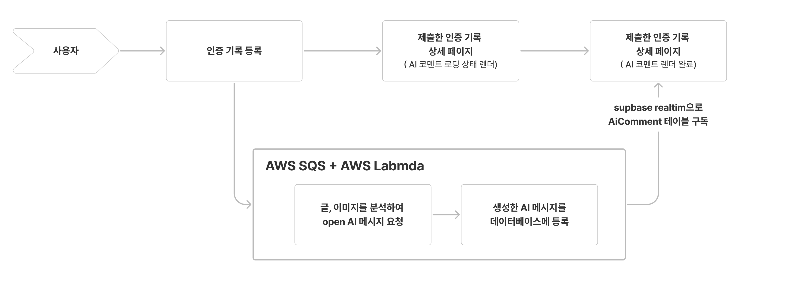

# BOOST PAL : 부스트 팔

 <br/>

<div align="center">

## [BOOST PAL 바로가기](https://cheer-dam.vercel.app/)

> BOOST PAL은 기록에 대한 **따뜻한 응원과 위로의 메시지를 전달하는 서비스**입니다.
>
> 사용자가 일상적인 **습관과 챌린지에 대한 기록**을 남기면,
> 사용자가 작성한 글과 이미지를 바탕으로 **OpenAI가 생성한 응원 메시지가 코멘트**로 추가됩니다.
> 이를 통해, 지속적인 활동과 **동기부여**를 제공할 수 있도록 돕습니다.

<br />
<a href="https://www.gomterview.com">


</a>
<br/>
</div>

- 디자인 기획 : [피그마](https://www.figma.com/design/LKzdjcOImadOrk1TC5cJ9Q/dam?node-id=0-1&t=k8Yrve9qtzBlOAuf-1)

## 목차

- [목차](#목차)
- [프로젝트 개발 계기](#프로젝트-개발-계기)
- [핵심 기능](#핵심-기능)
  - [귀여운 동물의 응원 코멘트를 받아보세요](#귀여운-동물의-응원-코멘트를-받아보세요)
  - [다양한 방식으로 인증 기록들을 확인해보세요](#다양한-방식으로-인증-기록들을-확인해보세요)
  - [추가 예정 기능](#추가-예정-기능)
- [기술 스택 및 서비스 구조도](#기술-스택-및-서비스-구조도)
- [유저 플로우](#유저-플로우)
- [트러블 슈팅](#-fe-기술적-도전)
  - [비동적으로 AI 코멘트 생성](#비동적으로-ai-코멘트-생성)
  - [AI 코멘트 렌더링 작업](#ai-코멘트-렌더링-작업)
  - [Next.js 캐싱](#nextjs-캐싱)
- [ERD](#erd)
- [프로젝트 실행 방법](#프로젝트-실행-방법)
- [폴더 구조](#폴더-구조)

## 프로젝트 개발 계기

싫어하고 힘들어하던 운동을, 지속적인 기록과 사람들의 응원과 위로를 통해 달리기 챌린지 완주 뿐만 아니라, 취미 생활로 갖게 되었습니다.<br/>
이 경험으로 어떤 인증을 기록해도 응원하는 AI와 기록 저장을 벤치마킹 했습니다.<br/>

시작하는 것과 꾸준히 하는 것은 너무 어렵습니다. 하지만, 누군가가 함께 응원해준다면 이를 지속할 수 있는 힘이 생긴다는 것을 믿습니다.<br/>
한 명이라도 쓸 수 있는, 쓰고 싶어하는 서비스를 만들고 싶었습니다. 지금 이 서비스의 고객은 개발자인 저를 타겟팅합니다.

| 실제로 진행한 달리기 인증 기록과 응원 코멘트, 이모지                             | 챌린지 완주한 기록                                      |
| -------------------------------------------------------------------------------- | ------------------------------------------------------- |
|  |  |

## 핵심 기능

### 귀여운 동물의 응원 코멘트를 받아보세요

> - 기록 하고싶은 인증의 이미지와 내용들을 입력하고 그에 대한 AI 기반 응원 코멘트로 동기부여를 받아보세요.
> - 다른 사용자의 인증에 호응하며, 서로를 복돋아줄 수 있습니다.

| 업로드 과정 및 AI 코멘트 받기                            | 결과물                                                        |
| -------------------------------------------------------- | ------------------------------------------------------------- |
|  |  |

### 다양한 방식으로 인증 기록들을 확인해보세요

> - 인증 횟수가 제일 많은 주제를 메인페이지에서 확인 할 수 있습니다.
> - 캘린더 형식으로 꾸준한 인증을 한 눈에 확인해보세요.
> - 인증 내용을 검색할 수 있습니다.

| 제일 인증 수가 많은 카테고리            | 전체 인증                                | 캘린더로 확인하는 나의 인증                  | 내가 작성한 모든 인증                      | 검색으로 인증 찾기                        |
| --------------------------------------- | ---------------------------------------- | -------------------------------------------- | ------------------------------------------ | ----------------------------------------- |
|  | > | > |  |  |

> ### 추가 예정 기능
>
> - 로그인 편의성을 위하여 소셜 로그인 추가
> - 사용자가 다양한 타입의 응원 메시지를 받을 수있게 AI BOT 타입 추가
> - 글과 이미지 뿐만 아니라 주제에 대한 분석 후 AI 코멘트 추가

## 기술 스택 및 서비스 구조도


### **프론트엔드**

- **Next.js** : 다양한 기능을 제공하며, 특히 Server Actions를 통해 서버와 클라이언트 간의 쿼리 처리를 더욱 효율적으로 관리할 수 있음.
- **TypeScript** : 코드에서 타입 안정성을 확보하고, 오류를 사전에 방지하여 유지보수성을 향상시키기 위해 선택.
- **TailwindCSS** : 아토믹 CSS 클래스를 활용한 빠른 스타일링을 통해 프로젝트의 개발 속도를 높이고, 유지보수가 용이함.
- **React Hook Form** : 사용자 입력 폼에 대한 유효성 검증과 사용자 경험을 향상시키기 위한 UI 상태 관리를 간편하게 구현.
- **Zod** : 클라이언트와 서버 양쪽에서 입력값의 유효성 검증을 통해 데이터 무결성을 보장하고, Server Actions에서 타입 안정성을 유지.
- **Supabase Realtime** : 특정 테이블을 구독하여 실시간으로 데이터 변화에 반응하고, 클라이언트에 즉시 적용하기 위해 사용.
- **Cloudflare Image** : 이미지의 크기, 형식, 품질 최적화 및 성능 개선을 위한 이미지 처리 기능 활용.

### **백엔드**

- **Prisma** : 데이터베이스 스키마를 기반으로 한 타입 지원으로, 데이터베이스 작업 시 더 나은 개발 경험과 자동완성 지원을 제공.
- **Iron-session** : Next.js와 같은 서버리스 환경에서 비연결성 기반 세션을 쉽게 관리할 수 있어, 안전한 인증 세션 처리에 유리.
- **OpenAI** : AI 프롬프트 작성을 통해 사용자에게 맞춤형 응원 및 위로 메시지를 제공.
- **AWS SQS + Lambda** : 비동기 작업을 처리하고, 확장 가능한 비동기 프로세스를 지원하기 위해 사용.
- **Supabase** : 무료로 제공되는 관리형 데이터베이스를 사용하며, 실시간 기능을 제공하여 전체 백엔드 구조를 간소화.

## 유저 플로우


## 트러블 슈팅

### 비동적으로 AI 코멘트 생성

**이슈** : 사용자가 기록을 적성을 제출하면, 기록을 분석하여 ai comment 수신 및 ai 코멘트 등록 지연시간이 발생합니다.
사용자 경험을 보완하기위해 기록이 등록되면 바로 라우팅 시키되 ai 코멘트 생성 로직은 비동기적으로 작업합니다.

#### [개발 환경](https://github.com/j2h30728/cheer-dam/pull/9)

- 개발 단계에서는 open ai 메시지 요청 및 ai 코멘트 추가 로직을 setImmediate 함수를 사용하여 비동기 작업으로 등록했습니다.
- **문제점** : 하지만, 서버리스 환경에서의 배포를 진행했기 때문에 배포 환경에서는 setImmediate는 서버리스 함수의 timeout내에 결과를 반환하지 못하여 강제 종료 되었습니다.

#### [배포 환경](https://github.com/j2h30728/cheer-dam/pull/27)

- **해결** : 어느 환경에서나 동일하게 로직을 완료하기 위해, 비동기 로직을 AWS SQS + AWS Lambda로 옮겼습니다.

### [AI 코멘트 렌더링 작업](https://github.com/j2h30728/cheer-dam/pull/11)

- 비동기로 등록되는 ai 코멘트는 등록여부 확인은 웹소켓 기반으로 서비스되는 supabase realtime을 사용합니다.
- 특정 테이블(ai comment)를 구독하다가 ai 코멘트가 등록되면 사용자에게 보여줍니다.



### [Next.js 캐싱](https://github.com/j2h30728/cheer-dam/pull/29)

- **이슈** : Next.js의 `unstable_cache`로 인하여 삭제한 데이터가 계속적으로 렌더링 되는 이슈가 있었습니다.
- **해걸** : `revalidateTag`, `revalidatePath`를 사용하여 더욱 섬세하게 재검증을 진행하여 캐싱을 관리하였습니다. 또한, 편의성을 위하여 사용하는 캐시태그를 한 곳에 모아 관리하는 방법을 채택하였습니다.

## ERD


## 프로젝트 실행 방법

1. 프로젝트 클론

```javascript
$ git clone https://github.com/j2h30728/cheer-dam.git
```

2. 필수 도구 설치 (Install dependencies)

```javascript
$ npm install
```

3. 환경변수 설정 (Set up environment variables)

- 프로젝트의 루트 디렉토리에 `.env` 파일을 생성하고, 필요한 환경변수들을 설정합니다.
- 아래와 같이 설정합니다:

```bash
COOKIE_PASSWORD=/*최소 32 이상 랜덤 글자 설정*/
CLOUDFLARE_API_KEY=/* cloudflare API Key 설정 */
CLOUDFLARE_ACCOUNT_ID=/* cloudflare Account Id 설정 */
DATABASE_URL=/* 데이터베이스 url 설정 */
DIRECT_URL=/* 데이터베이스 directUrl 설정 */
OPENAI_API_KEY=/* OPEN AI API Key 설정 */
NEXT_PUBLIC_SUPABASE_URL=/* 데이터베이스 supabase url 설정 */
NEXT_PUBLIC_SUPABASE_ANON_KEY=/* 데이터베이스 supabase 접근 권한 역할 key 설정 */
SQS_QUEUE_URL=/* AWS SQS url 설정 */

```

프로젝트 실행 (Run the project)

```javascript
$ npm run dev
```

<br/>

## 폴더 구조

```js
├── app
│   ├── (auth)  // 비로그인 사용자가 사용할 수 있는 페이지 그룹
│   ├── (tab) // 로그인 시 사용되는 아래의 탭바가 사용되는 페이지 그룹
│   │   ├── calendar
│   │   ├── posts
│   │   │   └── [id]
│   │   ├── search
│   │   │   ├── action.ts
│   │   │   └── page.tsx
│   │   └── users
│   │       └── [username]
│   │           └── edit
│   ├── upload
│   ├── intro
│   ├── globals.css // 전역스타일링
│   ├── layout.tsx
│   ├── loading.tsx
│   └── page.tsx
├── components // 공통으로 사용되거나 도메인별로 분류한 컴포넌트
│   ├── calendar
│   ├── common // 공통 컴포넌트
│   ├── post
│   ├── skeleton-ui // 로딩상태에서 보여줄 스켈레톤 UI 컴포넌트
│   └── user
├── constants // 프로젝트에서 사용하는 상수 값 모음
├── hooks // 리액트 커스텀 훅 모음
├── lib // 서버와 클라이언트에서 공통으로 사용하는 함수 모음
│   ├── client // 클라이언트에서 공통으로 사용하는 함수 모음
│   ├── schema.ts // 서버에서 공통으로 사용하는 함수 모음
│   ├── server
│   └── utils.tsx
├── middleware.ts // next.js middleware
└── service // 네트워크 계층에서의 공통 쿼리 함수 모음
prisma
└── schema.prisma // prisma 데이터 스키마
```
