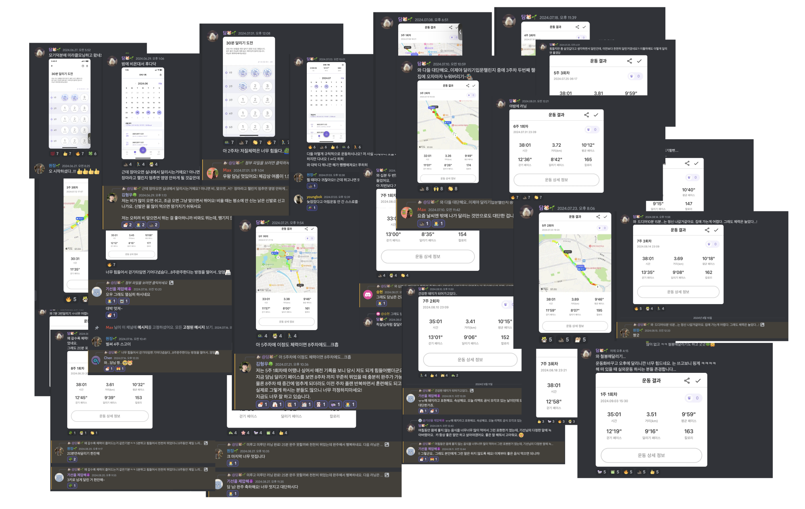
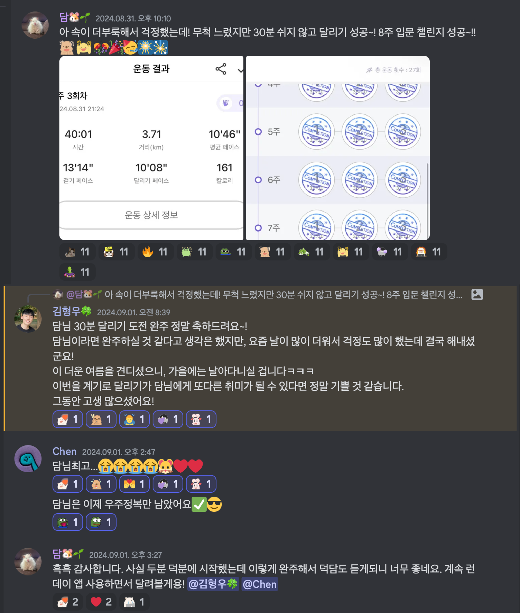
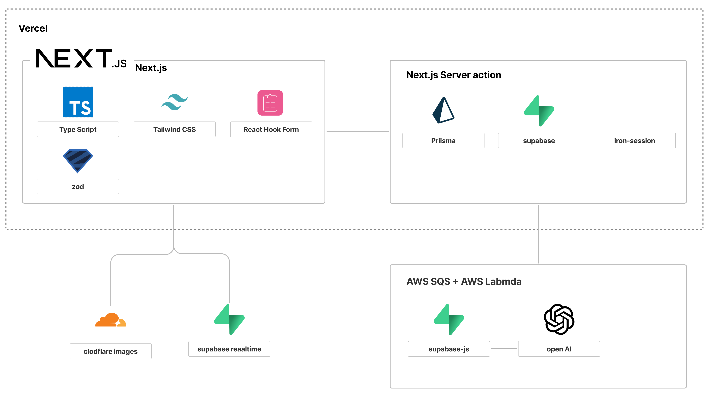
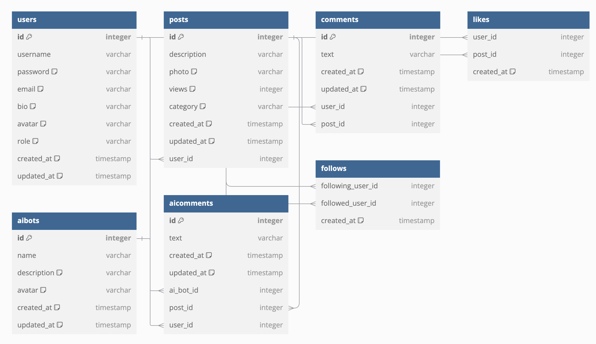

# BOOST PAL

<p align="middle" >

</p>

## 프로젝트 설명

사용자가 일상적인 습관과 챌린지에 대한 기록을 남기면, 해당 기록을 분석하여 지속적인 활동을 유지할 수 있도록 따뜻한 응원과 위로의 메시지를 전달하는 서비스입니다. <br/>
사용자가 작성한 글과 이미지를 바탕으로 OpenAI가 생성한 응원 메시지가 코멘트로 추가되어, 더 큰 동기부여를 제공할 수 있도록 돕습니다.

## 프로젝트 개발 계기

싫어하고 힘들어하던 운동을, 지속적인 기록과 사람들의 응원과 위로를 통해 달리기 챌린지 완주 뿐만 아니라, 취미 생활로 갖게 되었습니다.<br/>
이 경험으로 어떤 인증을 기록해도 응원하는 AI와 기록 저장을 벤치마킹 했습니다.<br/>

시작하는 것과 꾸준히 하는 것은 너무 어렵습니다. 하지만, 누군가가 함께 응원해준다면 이를 지속할 수 있는 힘이 생긴다는 것을 믿습니다.<br/>
한 명이라도 쓸 수 있는, 쓰고 싶어하는 서비스를 만들고 싶었습니다. 지금 이 서비스의 고객은 개발자인 저를 타겟팅합니다.

| 실제로 진행한 달리기 인증 기록과 응원 코멘트, 이모지                             | 챌린지 완주한 기록                                      |
| -------------------------------------------------------------------------------- | ------------------------------------------------------- |
|  |  |

## 핵심 기능

#### 기록

- 기록하고 싶은 주제, 이미지, 글 내용을 입력

#### 응원

- **인증 기록에 대한 응원 메시지 AI 코멘트 생성**
  - 습관과 챌린지에 대한 기록(이미지, 글)을 기반으로 귀여운 동물이 응원하는 코멘트
- 작성된 인증 기록에 댓글을 통한 상호작용
- 조회수 확인과 좋아요 버튼 상호작용

#### 확인

- 캘린더를 통하여 인증 기록을 월 단위로 한 눈에 확인
- 검색기능을 통해 원하는 내용의 기록을 검색

## 기술 스택 및 서비스 구조도



## 유저 플로우


## ERD



## 프로젝트 실행 방법

1. 프로젝트 클론

```javascript
$ git clone https://github.com/j2h30728/cheer-dam.git
```

2. 필수 도구 설치 (Install dependencies)

```javascript
$ npm install
```

3. 환경변수 설정 (Set up environment variables)

- 프로젝트의 루트 디렉토리에 `.env` 파일을 생성하고, 필요한 환경변수들을 설정합니다.
- 아래와 같이 설정합니다:

```bash
COOKIE_PASSWORD=/*최소 32 이상 랜덤 글자 설정*/
CLOUDFLARE_API_KEY=/* cloudflare API Key 설정 */
CLOUDFLARE_ACCOUNT_ID=/* cloudflare Account Id 설정 */
DATABASE_URL=/* 데이터베이스 url 설정 */
DIRECT_URL=/* 데이터베이스 directUrl 설정 */
OPENAI_API_KEY=/* OPEN AI API Key 설정 */
NEXT_PUBLIC_SUPABASE_URL=/* 데이터베이스 supabase url 설정 */
NEXT_PUBLIC_SUPABASE_ANON_KEY=/* 데이터베이스 supabase 접근 권한 역할 key 설정 */
SQS_QUEUE_URL=/* AWS SQS url 설정 */

```

프로젝트 실행 (Run the project)

```javascript
$ npm run dev
```

<br/>

## 폴더 구조

```js
├── app
│   ├── (auth)  // 비로그인 사용자가 사용할 수 있는 페이지 그룹
│   ├── (tab) // 로그인 시 사용되는 아래의 탭바가 사용되는 페이지 그룹
│   │   ├── calendar
│   │   ├── posts
│   │   │   └── [id]
│   │   ├── search
│   │   │   ├── action.ts
│   │   │   └── page.tsx
│   │   └── users
│   │       └── [username]
│   │           └── edit
│   ├── upload
│   ├── intro
│   ├── globals.css // 전역스타일링
│   ├── layout.tsx
│   ├── loading.tsx
│   └── page.tsx
├── components // 공통으로 사용되거나 도메인별로 분류한 컴포넌트
│   ├── calendar
│   ├── common // 공통 컴포넌트
│   ├── post
│   ├── skeleton-ui // 로딩상태에서 보여줄 스켈레톤 UI 컴포넌트
│   └── user
├── constants // 프로젝트에서 사용하는 상수 값 모음
├── hooks // 리액트 커스텀 훅 모음
├── lib // 서버와 클라이언트에서 공통으로 사용하는 함수 모음
│   ├── client // 클라이언트에서 공통으로 사용하는 함수 모음
│   ├── schema.ts // 서버에서 공통으로 사용하는 함수 모음
│   ├── server
│   └── utils.tsx
├── middleware.ts // next.js middleware
└── service // 네트워크 계층에서의 공통 쿼리 함수 모음
prisma
└── schema.prisma // prisma 데이터 스키마
```
